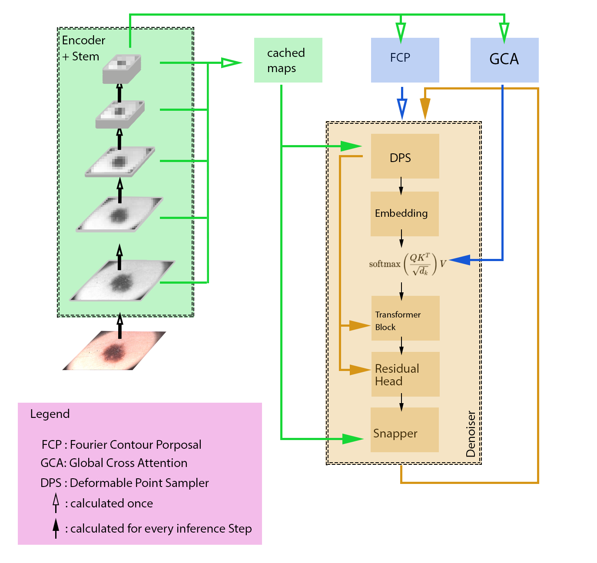
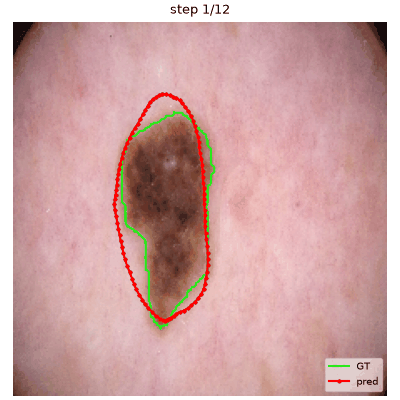
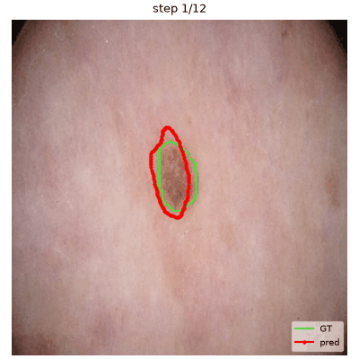

# P2SDiff — Boundary-Point Diffusion for Segmentation (V5)

**Segmentation as boundary-point generation.**

Instead of denoising per-pixel intensities, the diffusion process runs on the **2D coordinates of `N` ordered boundary points**; the denoised polygon is rasterized into a binary mask and scored with Dice / IoU.

## Architecture

<p align="center">
  
</p>

## Sampling process

Two examples of the DDIM denoising trajectory, from pure noise to the final
contour (see `--gif` under "Example runs" for how to generate these
yourself):

<p align="center">
  
  
</p>

## Idea

```text
mask
  │
  └── contour ──► N ordered points
                   (arc-length uniform, [-1,1])
                   │
                   │ ground-truth x₀
                   ▼
            forward q(xₜ|x₀)
            add Gaussian noise (DDPM, T=1000)
                   │
image ─► backbone ─► multi-scale feature pyramid
                   │
                   ▼
        GLOBAL: ContourProposalHead
        deterministic coarse contour (Fourier harmonics)
        → position, size, coarse shape
                   │
                   ▼
        LOCAL: ContourDenoiser predicts residual on top of proposal
                   │
                   ├── per-point sampler (input / deformable / attention)
                   │   reads finer pyramid scales, time-gated
                   │
                   └── optional global cross-attention branch
                       reads pooled coarsest scales instead —
                       lets local sampler drop those scales
                       (`--local_drop_coarsest`)
                   │
                   ▼
        DDIM, deterministic, CFG
                   │
                   ├── optional in-loop BoundarySnapper (last ~30% of steps)
                   │
                   ▼
        BOUNDARY: BoundarySnapper (post-DDIM)
        confidence-gated normal-offset correction
                   │
                   ▼
              fillPoly → binary mask → Dice / IoU
```

The three stages map directly onto three separate modules: **global**
(`ContourProposalHead`, coarse shape from the coarsest features, no
diffusion), **local** (`ContourDenoiser`, the diffusion process itself,
refining detail near each point), and **boundary** (`BoundarySnapper`,
pixel-precise correction after/during sampling). Each is trained for its
own sub-task rather than one network doing everything.

## Global cross-attention & scale dropping

The local sampler is inherently local: every read happens at or near the
point's own position, so it has no way to fix a badly mislocalized point.
`--use_global_attn` adds a cross-attention branch that lets every point
attend over a compact, pooled memory built from the coarsest backbone
scales instead — a genuinely global view of the image. It's timestep-gated
(`--global_attn_gate_schedule`) to matter most at high `t`, when
localization error is largest, and fade out late in sampling.

Since global structure is now covered by this branch, the *local* sampler
no longer needs the coarsest scales itself: `--local_drop_coarsest N`
removes the coarsest `N` scales from the local sampler's pyramid only — the
global branch still always sees the full pyramid.

## Hybrid boundary snapping

`--snap_mode both` runs the `BoundarySnapper` twice: in-loop, on the last
`--snap_t_threshold_frac` fraction of DDIM steps, correcting intermediate
contours before their error propagates into later steps; and again
post-hoc, as a final cleanup pass once sampling is done.

## Example runs

**Attention sampler + global attention, dropping 2 coarsest scales:**
```bash
python -m x0_prediction.train --dataset isic2018 \
    --sampler_type attention --attn_sampler_window 5 --attn_sampler_heads 4 \
    --deform_n_samples 8 --top_k_scales 2 \
    --use_global_attn True --global_attn_levels 2 --local_drop_coarsest 2 \
    --proposal_target residual --snap_mode both --snap_t_threshold_frac 0.30 \
    --gif --gif_steps 50 \
    --out_dir x0_prediction/runs/baseline_attention_seed_42
```

**Deformable sampler + global attention, dropping 1 coarsest scale:**
```bash
python -m x0_prediction.train --dataset isic2018 \
    --sampler_type deformable --deform_n_samples 8 --deform_radius_cells 2.5 \
    --top_k_scales 2 \
    --use_global_attn True --global_attn_levels 1 --local_drop_coarsest 1 \
    --proposal_target residual --snap_mode both --snap_t_threshold_frac 0.30 \
    --lambda_boundary 0.4 \
    --gif --gif_steps 50 \
    --out_dir x0_prediction/runs/ablation_v17_phase2b_boundary_fine_deform
```